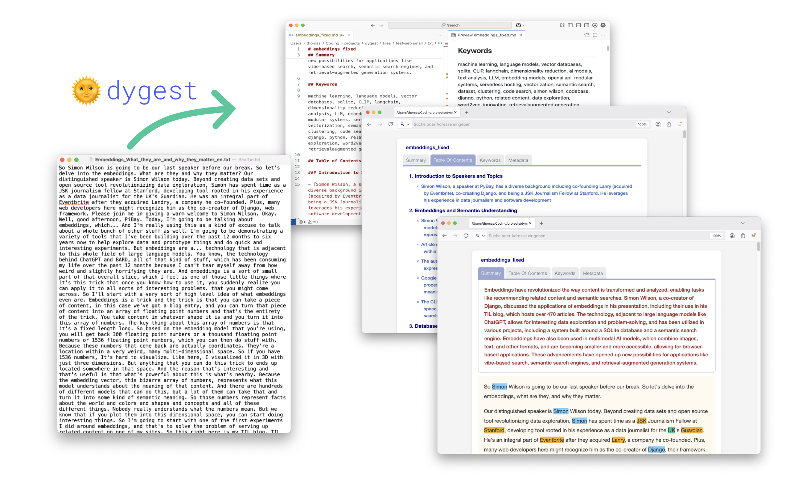

[](https://badge.fury.io/py/dygest)

# 🌞 dygest: Document Insights Generator

**dygest** is command line tool that takes `.txt` files as input and extracts content insights using **Large Language Models** and **NER** (Named Entity Recognition). 

It generates *summaries*, *keywords* and *table of contents* and exports human-readable `markdown` or `html` documents. It also comes with customizable template support for `html`.

<p align="center">
  
</p>

## Table of Contents

- [Features](#features)
- [Requirements](#requirements)
- [Installation](#installation)
- [Usage](#usage)
  - [Configuration](#configuration)
  - [Processing](#processing)
- [Acknowledgments](#acknowledgments)
- [Citation](#citation)

## Features

- **Text insights**  
  Generate concise insights for your text files using various LLM services by creating *summaries*, *keywords*, *table of contents* (TOC) and *named entities* (NER).
- **Unified LLM Interface**  
  dygest uses [litellm](https://github.com/BerriAI/litellm) and provides integration for various LLM service providers: `OpenAI`, `Anthropic`, `HuggingFace`, `Groq`, `Ollama` etc. Check the [complete provider list](https://docs.litellm.ai/docs/providers) for all available services. 
- **Token Friendly**  
  dygest performs token-heavy text analysis and summarization tasks. Therefore, the underlying LLM pipeline can be tailored to your needs and specific rate limits using a *mixed experts approach*.
- **Mixed Experts Approach**  
  dygest utilizes two fully customizable LLMs to handle different processing tasks. The first, referred to as the `light_model`, is designed for lighter tasks such as summarization and keyword extraction. The second, called the `expert_model`, is optimized for more complex tasks like constructing Tables of Contents (TOCs).  

  This flexibility allows for various pipeline configurations. For example, the `light_model` can run locally using `Ollama`, while the `expert_model` can leverage an external API service like `OpenAI` or `Groq`. This approach ensures efficiency and adaptability based on specific requirements.

- **Named Entity Recognition (NER)**  
  Named Entity Recognition via fast and reliable `flair` framework (identifies persons, organisations, locations etc.).
  
- **Customizable HTML Templates**  
  By default `dygest` will create a `.html` file that can be viewed in standard browsers and combines summaries, keywords, TOC and NER for your text. Two default templates are available (`tabs` and `plain`), but you are able to customize your own as well.

- **Input Formats**: `.txt`, `.csv`, `.xlsx`, `.doc`, `.docx`, `.pdf`, `.html`, `.xml`
  
- **Export Formats**: `.json`, `.md`, `.html`

## Requirements
- 🐍 Python `>=3.10` 
- 🔑 API keys for LLM services like `OpenAI`, `Anthropic` and `Groq` *and / or* a running `Ollama` instance

## Installation

### Install with `pip`

#### Create a Python virtual environment
```shell
python3 -m venv venv
```

#### Activate the environment
```shell
source venv/bin/activate
```

#### Install dygest
```shell
pip install dygest
```

### Install from source

#### Clone this repository
```shell
git clone https://github.com/tsmdt/dygest.git
cd dygest
```

#### Create a Python virtual environment
```shell
python3 -m venv venv
```

#### Activate the environment
```shell
source venv/bin/activate
```

#### Install dygest
```shell
pip install .
```

## Usage

### Configuration

Copy the `.env.example` in the project directory and rename it to `.env`. Update the **dygest** settings by running the `dygest config` command or edit the `.env` manually.

```shell
 Usage: dygest config [OPTIONS]

 Configure LLMs, Embeddings and Named Entity Recognition. (Config file: .env)

╭─ Options ──────────────────────────────────────────────────────────────────────────────────────────────────────────────────────────╮
│ --add_custom       -add               TEXT     Add a custom key-value pair to the config .env (format: KEY=VALUE). [default: None] │
│ --light_model      -l                 TEXT     LLM model name for lighter tasks (summarization, keywords) [default: None]          │
│ --expert_model     -x                 TEXT     LLM model name for heavier tasks (TOCs). [default: None]                            │
│ --embedding_model  -e                 TEXT     Embedding model name. [default: None]                                               │
│ --temperature      -t                 FLOAT    Temperature of LLM. [default: None]                                                 │
│ --sleep            -s                 FLOAT    Pause LLM requests to prevent rate limit errors (in seconds). [default: None]       │
│ --chunk_size       -c                 INTEGER  Maximum number of tokens per chunk. [default: None]                                 │
│ --ner                     --no-ner             Enable Named Entity Recognition (NER). Defaults to False. [default: no-ner]         │
│ --precise                 --fast               Enable precise mode for NER. Defaults to fast mode. [default: fast]                 │
│ --lang             -lang              TEXT     Language of file(s) for NER. Defaults to auto-detection. [default: None]            │
│ --view_config      -v                          View loaded config parameters.                                                      │
│ --help                                         Show this message and exit.                                                         │
╰────────────────────────────────────────────────────────────────────────────────────────────────────────────────────────────────────╯
```

The configuration is saved as `.env` in the project directory and can be easily edited either by hand or using the `dygest config` command.

If you want to add custom keys and values (e.g. for adding a custom api_base) just type `dygest config -add CUSTOM_PROVIDER_API_BASE=https://custom-provider.com/v1`

```dotenv
LIGHT_MODEL='ollama/gemma3:12b'
EXPERT_MODEL='groq/llama-3.3-70b-versatile'
EMBEDDING_MODEL='ollama/nomic-embed-text:latest'
TEMPERATURE='0.1'
SLEEP='0'
CHUNK_SIZE='1000'
NER='True'
NER_LANGUAGE='auto'
NER_PRECISE='False'

# API KEYS
OPENAI_API_KEY=''
GROQ_API_KEY=''

# CUSTOM SETTINGS
OLLAMA_API_BASE='http://localhost:11434'
```

### Processing
Run the **dygest** LLM pipeline with the `dygest run` command:

```shell
 Usage: dygest run [OPTIONS]

 Create insights for your documents (summaries, keywords, TOCs).

╭─ Options ──────────────────────────────────────────────────────────────────────────────────────────────────────────────────────────╮
│ --files             -f         TEXT                      Path to the input folder or file. [default: None]                         │
│ --output_dir        -o         TEXT                      If not provided, outputs will be saved in the input folder.               │
│                                                          [default: None]                                                           │
│ --export_format     -ex        [all|json|markdown|html]  Set the data format for exporting. [default: html]                        │
│ --toc               -t                                   Create a Table of Contents (TOC) for the text. Defaults to False.         │
│ --summarize         -s                                   Include a short summary for the text. Defaults to False.                  │
│ --keywords          -k                                   Create descriptive keywords for the text. Defaults to False.              │
│ --sim_threshold     -sim       FLOAT                     Similarity threshold for removing duplicate topics. [default: 0.85]       │
│ --default_template  -dt        [tabs|plain]              Choose a built-in HTML template ('tabs' or 'plain'). [default: tabs]      │
│ --user_template     -ut        DIRECTORY                 Provide a custom folder path for an HTML template. [default: None]        │
│ --skip_html         -skip                                Skip files if HTML already exists in the same folder. Defaults to False.  │
│ --export_metadata   -meta                                Enable exporting metadata to output file(s). Defaults to False.           │
│ --verbose           -v                                   Enable verbose output. Defaults to False.                                 │
│ --help                                                   Show this message and exit.                                               │
╰────────────────────────────────────────────────────────────────────────────────────────────────────────────────────────────────────╯
```

## Documentation

[View the documentation](https://tsmdt.github.io/dygest/) for detailed usage information.

## Acknowledgments

**dygest** uses great python packages:

- `litellm`: https://github.com/BerriAI/litellm
- `flair`: https://github.com/flairNLP/flair
- `typer`: https://github.com/fastapi/typer
- `json_repair`: https://github.com/mangiucugna/json_repair
- `markitdown`: https://github.com/microsoft/markitdown

## Citation

```bibtex
@software{dygest,
  author       = {Thomas Schmidt},
  title        = {DYGEST: Document Insights Generator},
  organization = {Mannheim University Library},
  year         = {2025},
  url          = {https://github.com/tsmdt/whisply}
}
```
