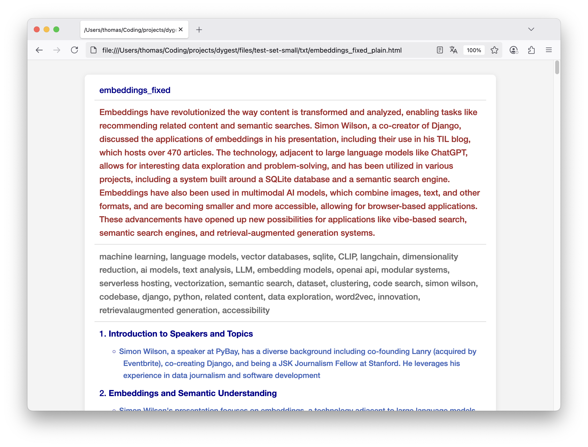

# dygest 🌞 docs

`dygest` is command line tool that takes `.txt` files as input and extracts content insights using **Large Language Models** and **NER** (Named Entity Recognition). 

It generates *summaries*, *keywords* and *table of contents* and exports human-readable `markdown` or `html` documents. It also comes with customizable template support for `html`.

## Table of contents

- [How it works](#how-it-works)
- [Setup](setup.md)
- [Configuration](config.md)

## How it works

  

### TXT processing with litellm
`dygest` processes `.txt` files (or whole folders) using Large Language Models with the python package [litellm](https://github.com/BerriAI/litellm) that provides integration for various LLM service providers: `OpenAI`, `Anthropic`, `HuggingFace`, `Groq`, `Ollama` etc. Check the [complete provider list](https://docs.litellm.ai/docs/providers) for all available providers.

### Summaries, keywords, tables of contents

For each file, `dygest` can generate *summaries*, *keywords*, and a structured *table of contents*, depending on the users needs.
 
### Different LLMs for different tasks

To make the "dygestion" of the `.txt` documents customizable and token-friendly, the LLM pipeline relies on an **mixed experts approach**. `dygest` utilizes two fully customizable LLMs to handle different processing tasks. The first, referred to as the `light_model`, is designed for lighter tasks such as summarization and keyword extraction. The second, called the `expert_model`, is optimized for more complex tasks like constructing Tables of Contents (TOCs).  

This flexibility allows for various pipeline configurations. For example, the `light_model` can run locally using `Ollama`, while the `expert_model` can leverage an external API service like `OpenAI` or `Groq`. This approach ensures efficiency and adaptability based on specific requirements.

### Customizable HTML templating

`dygest` exports humand-understandable `html` and `markdown` files and provides the two default `html` templates `plain` and `tabs`.

  

*Tabs Template with Summary, Table Of Contents, Keywords and Metadata*

  

*Plain Template with Summary, Keywords and Table Of Contents*

